# Agent项目架构解析

## 概述

本文档深入解析Agent智能体系统的架构设计，包括核心组件、数据流、模块协作和实现细节。

## 系统架构

### 架构图

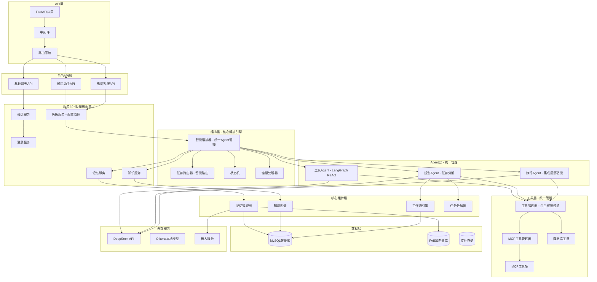

### 架构层次说明

| 层次 | 组件 | 职责 | 文件位置 |
|------|------|------|-------------|
| **API层** | FastAPI应用、中间件、路由 | HTTP请求处理、CORS、日志 | `app/main.py`, `app/middleware/` |
| **角色API层** | 各种角色专属API | 角色特定的业务接口 | `app/api/v1/` |
| **服务层** | 配置管理层 | 角色配置、基础服务初始化 | `app/services/` |
| **编排层** | 核心编排引擎 | Agent管理、智能路由、记忆集成 | `app/core/orchestrator/` |
| **Agent层** | Agent系统 | 具体任务执行 | `app/core/agent/` |
| **核心组件层** | 核心管理器 | 系统核心功能 | `app/core/` |
| **工具层** | 工具管理 | 工具调用、权限过滤 | `app/tools/` |
| **数据层** | 数据库、向量库 | 数据存储和检索 | `app/models/`, `app/dao/` |
| **外部服务** | LLM、嵌入服务 | 外部API调用 | `app/core/llm/`, `app/core/embedding/` |

## 核心组件详解

### 1. 智能编排器 (Orchestrator)

编排器是系统的核心调度组件，作为统一的Agent工厂和管理器，负责协调所有Agent和服务。**位置**: `app/core/orchestrator/orchestrator.py`

#### 架构设计

```python
class Orchestrator:
    """Agent编排器 - 统一的Agent工厂和管理器"""
    
    def __init__(
        self,
        db: Session,
        llm: BaseLLM,
        role_config: RoleConfig,
        memory_service: Optional[MemoryService] = None,
        knowledge_service: Optional[KnowledgeService] = None
    ):
        self.db = db
        self.llm = llm
        self.role_config = role_config
        self.memory_service = memory_service
        self.knowledge_service = knowledge_service
        
        # 创建角色专属的工具管理器（应用权限过滤）
        self.tool_manager = self._create_role_tool_manager()
        
        # 初始化所有Agent实例（单例模式）
        self._initialize_agents()
        
        # 初始化路由器、状态机和错误处理器
        self.router = TaskRouter(llm)
        self.state_machine = StateMachine()
        self.error_handler = ErrorHandler()
    
    def _create_role_tool_manager(self) -> ToolManager:
        """创建角色专属的工具管理器，应用权限过滤"""
        # 根据角色权限过滤工具
        # 创建角色专属工具管理器
    
    def _initialize_agents(self):
        """初始化所有Agent实例（单例模式）"""
        # 创建TaskDAO
        task_dao = TaskDAO(self.db)
        
        # 初始化各个Agent
        self.tool_agent = ToolAgent(self.llm, self.tool_manager)
        self.planner_agent = PlannerAgent(task_dao, self.tool_manager, self.llm)
        self.executor_agent = ExecutorAgent(self.llm, self.tool_manager)
```

#### 执行流程

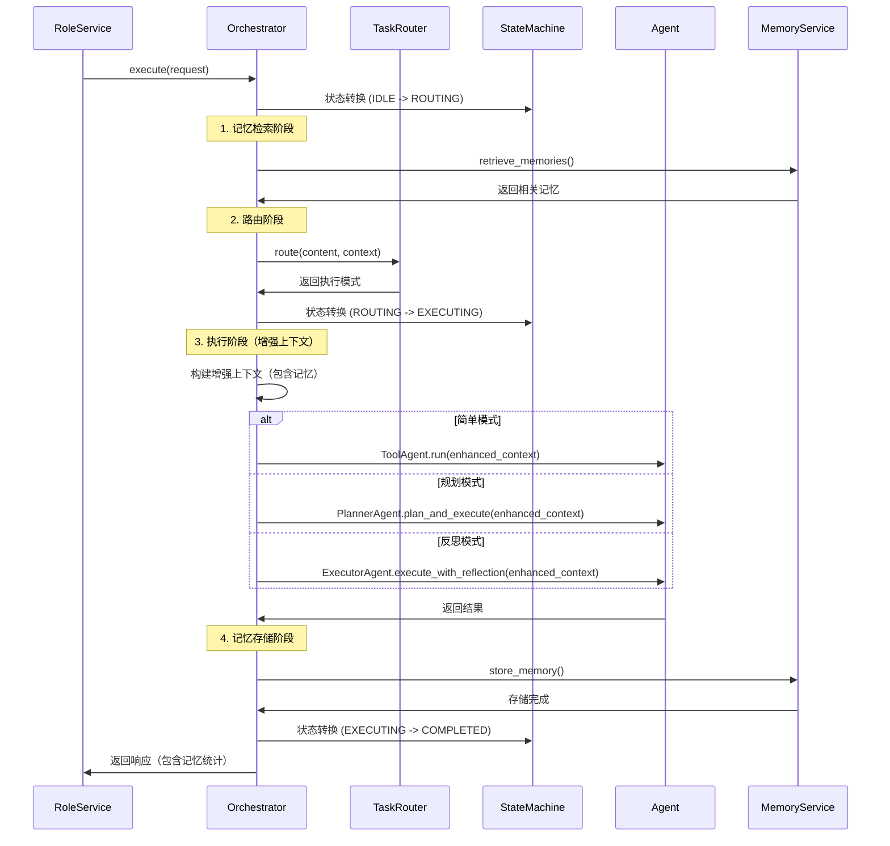

### 2. 角色服务 (RoleService)

角色服务是配置管理层，专注于角色配置管理和基础服务初始化。Agent创建和管理由Orchestrator统一负责。**位置**: `app/services/role_service.py`

#### 架构设计

```python
class RoleService:
    """角色服务 - 配置管理层"""
    
    def __init__(self, db: Session, llm: BaseLLM, role_type: str):
        self.db = db
        self.llm = llm
        self.role_type = role_type
        
        # 获取角色配置
        self.role_config = role_manager.get_role(role_type)
        
        # 初始化基础服务
        self.conversation_service = ConversationService(db)
        self.message_service = MessageService(db)
        
        # 根据角色配置初始化服务
        self._initialize_services()
        
        # 初始化编排器（统一Agent管理）
        self._initialize_orchestrator()
    
    def _initialize_services(self):
        """根据角色配置初始化服务"""
        # 记忆服务、知识服务初始化
    
    def _initialize_orchestrator(self):
        """初始化编排器（统一Agent管理）"""
        # 创建编排器，工具权限过滤由Orchestrator内部处理
        self.orchestrator = Orchestrator(
            db=self.db,
            llm=self.llm,
            role_config=self.role_config,
            memory_service=self.memory_service,
            knowledge_service=self.knowledge_service
        )
```

#### 角色配置差异

| 角色类型 | 记忆策略 | 工具权限 | 特殊功能 |
|---------|---------|---------|---------|
| **general** | 完整记忆管理 | 所有工具 | 任务规划、反思 |
| **customer_service** | 仅会话记忆 | 受限工具 | 快速响应 |

### 3. 记忆系统 (Memory System)

记忆系统采用分层架构，支持短期、长期和知识图谱三种记忆类型。**位置**: `app/core/memory/`

#### 架构设计

```python
class MemoryManager:
    """记忆管理器 - 分层记忆管理"""
    
    def __init__(self):
        # 记忆组件
        self.classifier = MemoryClassifier()  # 记忆分类器
        self.scorer = ImportanceScorer()  # 重要性评分器
        self.compressor = MemoryCompressor()  # 记忆压缩器
        self.forgetting = ForgettingMechanism()  # 遗忘机制
        
        # 存储组件
        self.short_term_store = ShortTermStore()  # 短期记忆存储
        self.long_term_store = LongTermStore()  # 长期记忆存储
        self.vector_store = MemoryVectorStore()  # 向量存储
        self.knowledge_graph = KnowledgeGraphManager()  # 知识图谱
        
        # 检索组件
        self.hybrid_retriever = HybridRetriever()  # 混合检索器
```

### 4. Agent系统

Agent系统包含多种类型的智能Agent，每个Agent负责不同的任务类型。**位置**: `app/core/agent/`

#### Agent类型和职责

| Agent类型 | 文件位置 | 主要职责 | 使用场景 |
|----------|---------|---------|---------|
| **ToolAgent** | `tool_agent.py` | 工具调用、简单对话 | 基础聊天、工具使用 |
| **PlannerAgent** | `planner_agent.py` | 任务规划、分解 | 复杂任务处理 |
| **ExecutorAgent** | `executor_agent.py` | 任务执行 + **反思功能** | 高质量任务执行 |
| **SimpleAgent** | `simple_agent.py` | 简单对话 | 轻量级对话 |

#### ExecutorAgent内部架构（集成反思功能）

**ExecutorAgent是反思功能的完整实现，包含内部反思组件**：

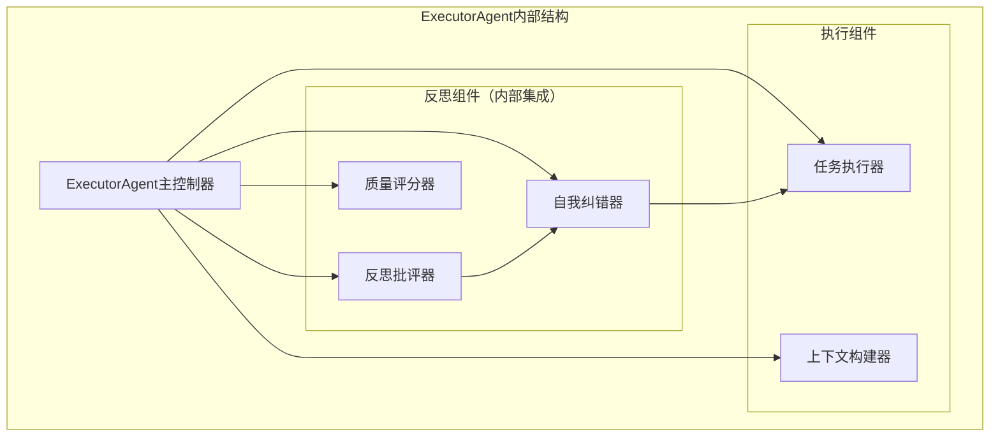

**反思功能使用流程**：

1. **Orchestrator智能路由**：
   - TaskRouter分析用户请求，自动选择最适合的执行模式
   - 反思模式适用于：代码生成、复杂分析、高质量输出任务
   - 用户无需手动选择，系统自动判断

2. **ExecutorAgent中的反思循环**：
   ```python
   # ExecutorAgent.execute_with_reflection()
   while retry_count <= max_retries:
       # 1. 执行任务
       execution_result = await self._execute_single(context, retry_count)
       
       # 2. 反思评估（内部ReflectionCritic）
       feedback = await self.critic.evaluate(execution_result["output"], context)
       
       # 3. 判断是否需要重试（内部SelfCorrector）
       if not self.self_corrector.should_retry(feedback, retry_count):
           return result  # 质量达标，返回结果
       
       # 4. 生成纠错建议并重试（内部SelfCorrector）
       suggestions = await self.self_corrector.generate_suggestions(feedback)
       retry_count += 1
   ```

3. **反思功能的监控**：
   - 反思统计信息通过系统监控接口 `/health/stats` 提供
   - 不暴露反思的内部实现细节
   - 保持架构的简洁性和封装性

#### ToolAgent实现

```python
class ToolAgent(BaseAgent):
    """工具Agent - 基于LangGraph的工具调用Agent"""
    
    def __init__(self, llm: BaseLLM, tool_manager: ToolManager):
        self.llm = llm
        self.tool_manager = tool_manager
        
        # 构建LangGraph工作流
        self.workflow = self._build_workflow()
    
    def _build_workflow(self) -> StateGraph:
        """构建LangGraph工作流"""
        workflow = StateGraph(AgentState)
        
        # 添加节点
        workflow.add_node("agent", self._agent_node)
        workflow.add_node("tools", self._tools_node)
        
        # 添加边
        workflow.add_edge("agent", "tools")
        workflow.add_edge("tools", "agent")
        
        # 设置入口点
        workflow.set_entry_point("agent")
        
        return workflow.compile()
```

### 5. 工具系统

工具系统提供各种外部工具调用能力。**位置**: `app/tools/`

#### 工具架构

```python
class ToolManager:
    """工具管理器 - 统一管理所有工具"""
    
    def __init__(self):
        self.tools = {}
        self.mcp_manager = MCPManager()
        self._register_tools()
    
    def _register_tools(self):
        """注册所有工具"""
        # 注册数据库工具
        self.register_tool(DatabaseTool())
        
        # 注册MCP工具
        mcp_tools = self.mcp_manager.get_available_tools()
        for tool in mcp_tools:
            self.register_tool(tool)
```

#### 工具类型

| 工具类型 | 文件位置 | 功能描述 |
|---------|---------|---------|
| **DatabaseTool** | `database/mysql_tool.py` | MySQL数据库查询 |
| **MCPTools** | `mcp/wrapper.py` | MCP协议工具集 |
| **自定义工具** | `tools/` | 项目特定工具 |

## 数据流设计

### 1. 请求处理流程

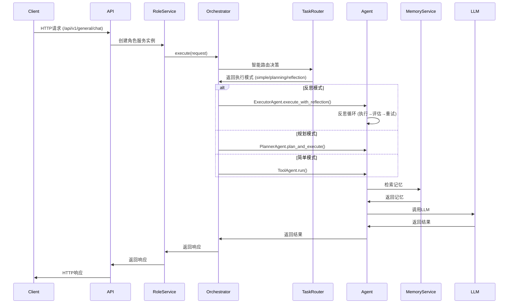

### 2. 角色服务初始化流程

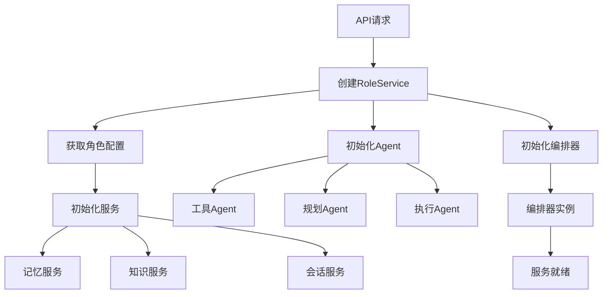

### 3. 记忆存储流程

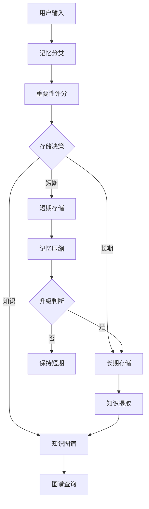

## 模块协作关系

### 1. API层到服务层的调用关系

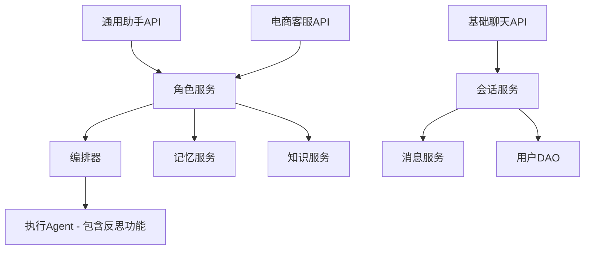

### 2. 服务层到核心层的调用关系

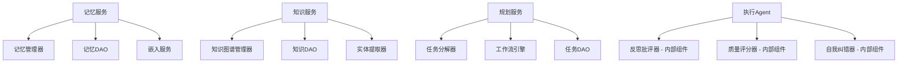

### 3. 编排器到Agent的调用关系

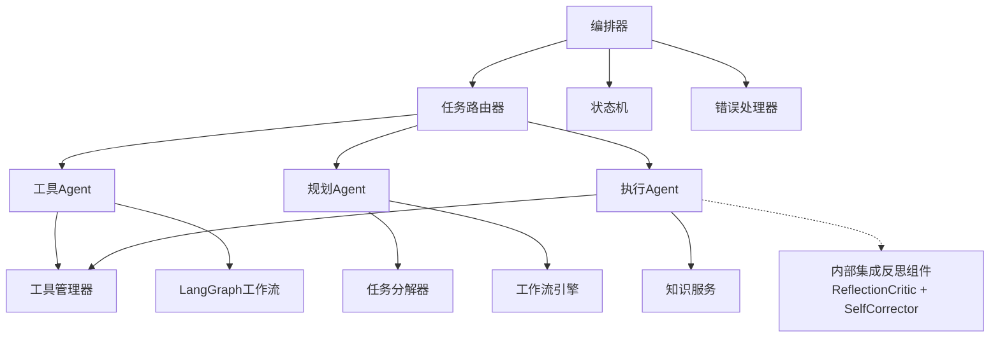

## 关键技术实现

### 1. LangGraph集成

项目使用LangGraph实现Agent的工作流管理：

```python
# ToolAgent中的LangGraph实现
from langgraph.graph import StateGraph, END

class ToolAgent(BaseAgent):
    def _build_workflow(self) -> StateGraph:
        """构建LangGraph工作流"""
        workflow = StateGraph(AgentState)
        
        # 添加节点
        workflow.add_node("agent", self._agent_node)
        workflow.add_node("tools", self._tools_node)
        
        # 添加条件边
        workflow.add_conditional_edges(
            "agent",
            self._should_continue,
            {
                "continue": "tools",
                "end": END
            }
        )
        
        workflow.add_edge("tools", "agent")
        workflow.set_entry_point("agent")
        
        return workflow.compile()
```

### 2. MCP工具集成

项目支持MCP (Model Context Protocol) 工具：

```python
# MCP工具管理器
class MCPManager:
    """MCP工具管理器"""
    
    def __init__(self):
        self.mcp_servers = {}
        self._load_mcp_config()
    
    def _load_mcp_config(self):
        """加载MCP配置"""
        with open("mcp.json", "r") as f:
            config = json.load(f)
            self.mcp_servers = config.get("mcpServers", {})
    
    def get_available_tools(self) -> List[BaseTool]:
        """获取可用的MCP工具"""
        tools = []
        for server_name, server_config in self.mcp_servers.items():
            # 启动MCP服务器并获取工具
            tools.extend(self._get_server_tools(server_name, server_config))
        return tools
```

### 3. 记忆系统实现

记忆系统使用FAISS进行向量检索：

```python
# 记忆向量存储
class MemoryVectorStore:
    """记忆向量存储"""
    
    def __init__(self, dimension: int = 384):
        self.dimension = dimension
        self.index = faiss.IndexFlatIP(dimension)  # 内积索引
        self.metadata = []
    
    def add_memories(self, memories: List[MemoryItem], embeddings: np.ndarray):
        """添加记忆向量"""
        self.index.add(embeddings.astype('float32'))
        self.metadata.extend(memories)
    
    def search(self, query_embedding: np.ndarray, k: int = 5) -> List[MemoryItem]:
        """搜索相似记忆"""
        scores, indices = self.index.search(query_embedding.astype('float32'), k)
        return [self.metadata[i] for i in indices[0]]
```

## 部署架构

### 1. 开发环境架构

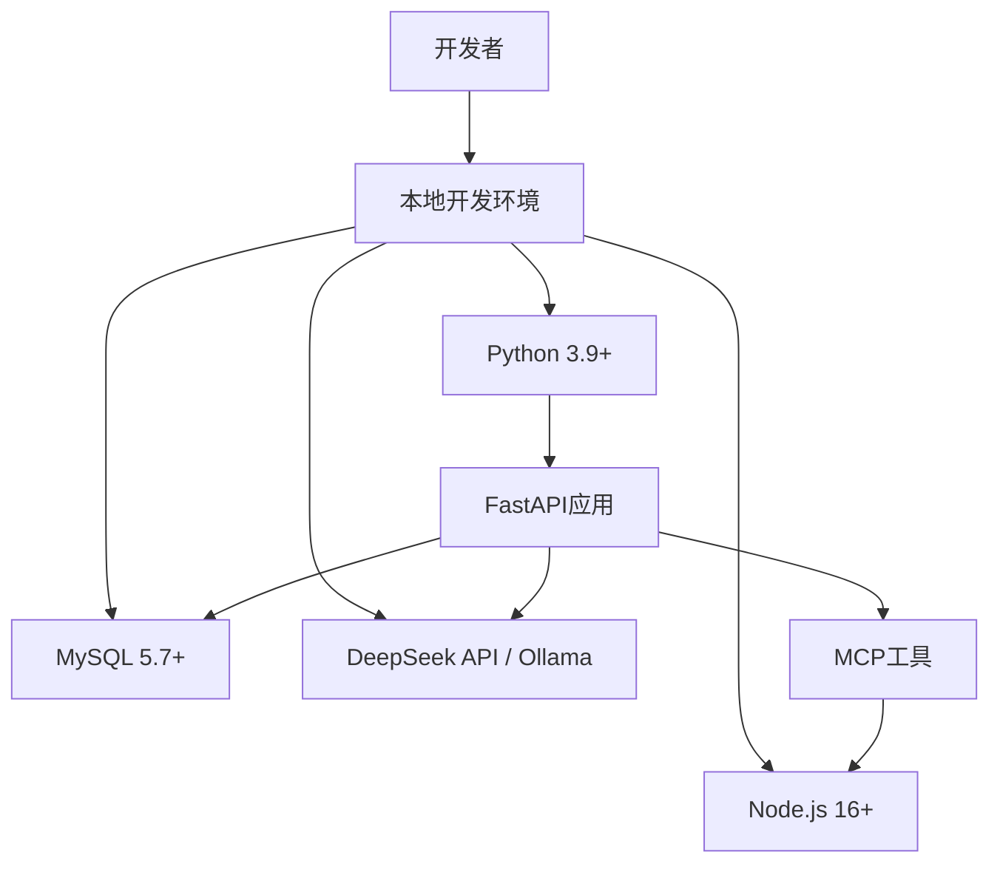

### 2. 生产环境架构

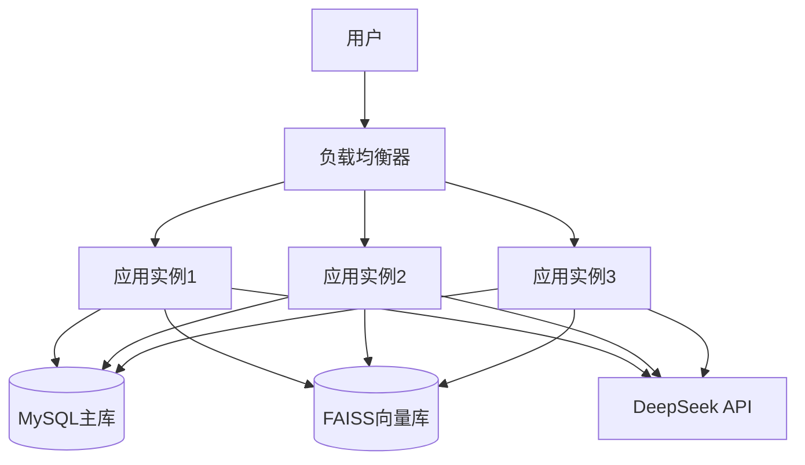

### 3. 容器化部署

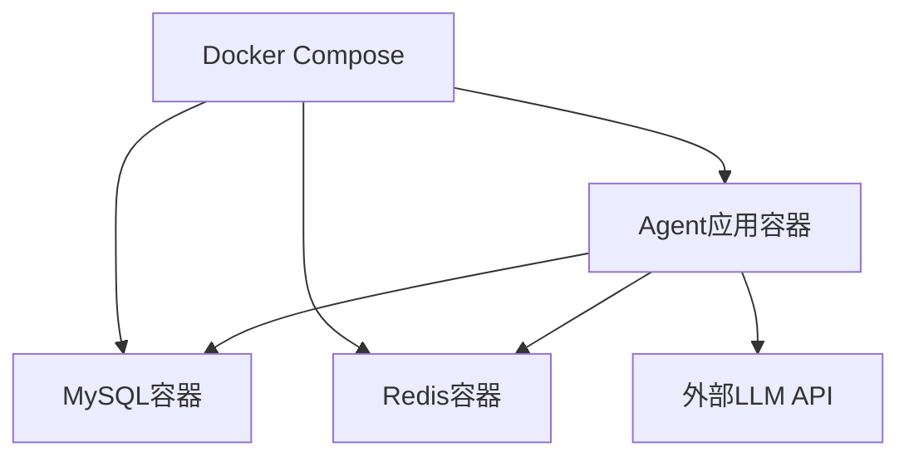

## 总结

Agent智能体系统采用分层模块化架构，具有以下特点：

### 架构特点

1. **分层设计**: API层 → 服务层（配置管理） → 编排层（核心引擎） → Agent层（统一管理） → 核心组件层
2. **统一Agent管理**: Orchestrator作为唯一的Agent工厂，统一管理所有Agent实例
3. **智能编排**: 集成记忆系统、智能路由、状态管理的完整执行流程
4. **反思集成**: 反思功能完全集成在ExecutorAgent内部，反思组件作为ExecutorAgent的内部组件
5. **工具权限统一**: 在Orchestrator层统一管理工具权限过滤
6. **记忆深度集成**: 自动记忆检索、上下文增强、结果存储
7. **角色配置管理**: RoleService专注配置管理，Agent创建由Orchestrator负责
8. **异步处理**: 基于FastAPI的异步架构

### 核心优势

- **资源高效**: 避免重复创建Agent，节省内存
- **职责清晰**: 每层只做一件事，易于理解和维护
- **智能路由**: 基于规则+LLM的智能路由，准确选择执行模式
- **记忆系统集成**: 深度集成记忆检索和存储，提升上下文理解
- **扩展性强**: 新增Agent或角色只需修改Orchestrator
- **符合最佳实践**: 基于LangGraph官方推荐的Multi-Agent模式

### 关键文件结构

```
app/
├── api/v1/          # API接口层
│   ├── health.py    # 健康检查和系统统计
│   ├── general.py   # 通用助手API
│   ├── customer_service.py  # 电商客服API
│   └── chat.py      # 基础聊天API
├── services/        # 轻量级配置层
│   ├── role_service.py  # 角色服务（简化）
│   ├── memory_service.py  # 记忆服务
│   └── knowledge_service.py  # 知识服务
├── core/           # 核心组件层
│   ├── orchestrator/  # 智能编排器（统一Agent管理）
│   │   ├── orchestrator.py  # 核心编排引擎
│   │   ├── router.py  # 智能路由（增强）
│   │   ├── state_machine.py  # 状态机
│   │   └── error_handler.py  # 错误处理器
│   ├── agent/        # Agent系统（统一管理）
│   │   ├── base.py  # 基类（修复）
│   │   ├── tool_agent.py  # 工具Agent
│   │   ├── planner_agent.py  # 规划Agent（修复）
│   │   └── executor_agent.py  # 执行Agent（集成反思）
│   ├── memory/       # 记忆系统
│   ├── knowledge/    # 知识图谱
│   └── tools/        # 工具系统
├── models/         # 数据模型
├── dao/           # 数据访问层
└── utils/         # 工具类
```

### 设计原则

1. **职责分离**: 每层专注自己的职责，避免功能重复
2. **统一管理**: Orchestrator统一管理所有Agent实例
3. **深度集成**: 记忆系统深度集成到执行流程
4. **智能路由**: TaskRouter智能路由规则优化
5. **架构清晰**: 每层职责明确，调用关系简化

这个架构设计既保证了系统的功能完整性，又显著提升了代码的可维护性、可扩展性和执行效率。
